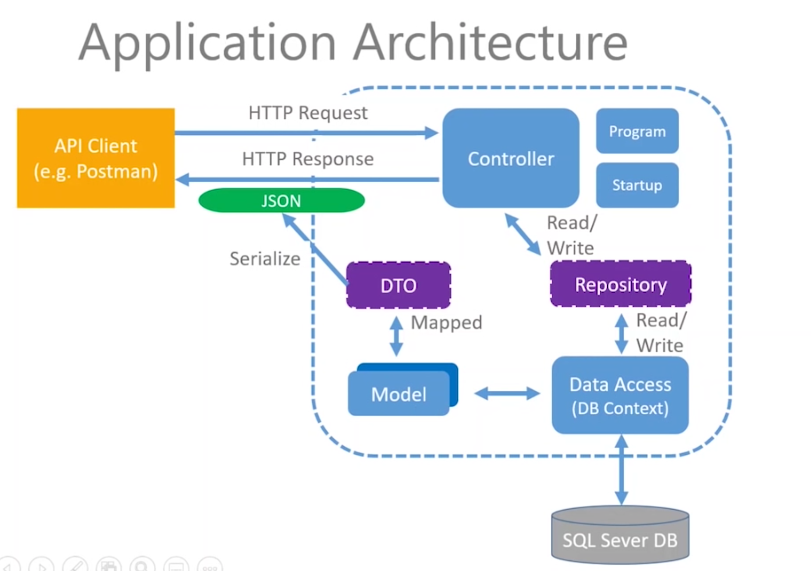

## Project Introduction
>EF Core ORM, ASP.NET Core, MVC, RESTful APIs, C#, PostgreSql

### Application Architecture

### CRUD Features
- /api/commands,GET,READ, Read all resources, 200 OK, 400 Bad Request/404 Not Found
- /api/commands/{id},GET,READ, Read a single resource, 200 OK, 400 Bad Request/404 Not Found
- /api/commands,POST,CREATE, Create a new resource, 201 Created, 400 Bad Request/405 Not Allowed
- /api/commands{id},PUT,UPDATE, Update an entire resource, 204 No Content
- /api/commands{id},PATCH,UPDATE, Update partial resource, 200 OK/204 No Content
- /api/commands{id},DELETE,DELETE, Delete a single resource, 200 OK/204 No Content